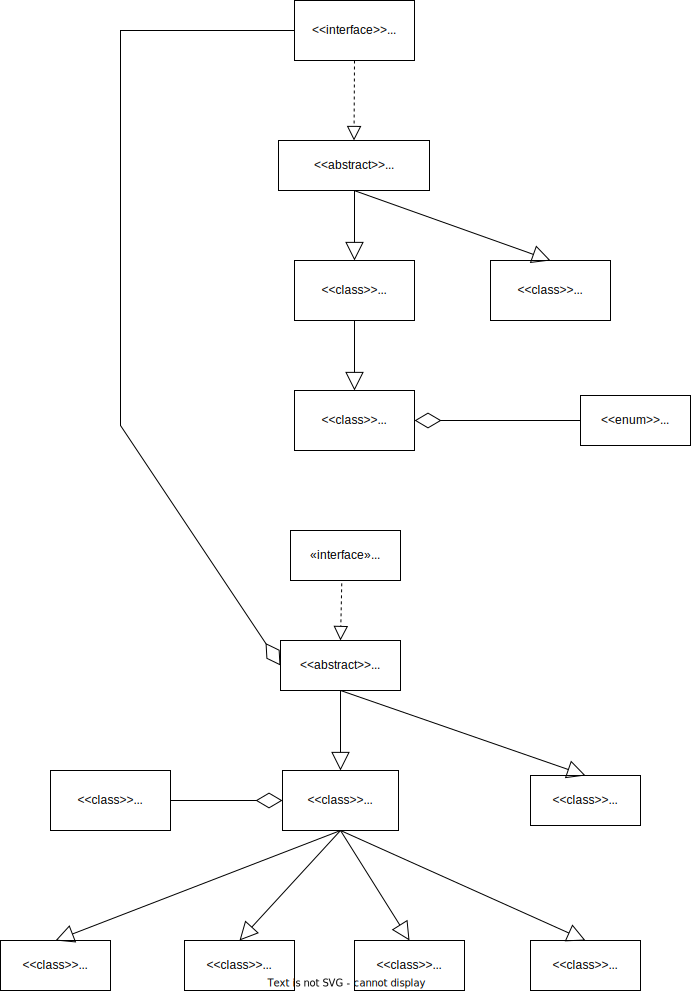

# Starfleet Fleet Management System

This project is an **Object-Oriented Java system** for managing a fleet of spaceships and crew members. It demonstrates key OOP principles such as **inheritance, polymorphism, and encapsulation**.

## Features
- 🚀 **Manage multiple spaceship types** (Fighters, Bombers, Transport Ships, Stealth Cruisers, etc.).
- 👩‍🚀 **Crew member hierarchy** (Officers, Crew Members, Cylons, etc.).
- 🔫 **Weapon and firepower calculations**.
- 📊 **Fleet-wide statistics processing** via `StarfleetManager`.
- ✅ **Automated testing using `StarfleetManagerTester.java`**.

## Project Structure
```
src/starfleet/
│── Bomber.java
│── ColonialViper.java
│── CylonRaider.java
│── Fighter.java
│── Spaceship.java
│── myAbstractSpaceship.java
│── CrewMember.java
│── CrewWoman.java
│── Cylon.java
│── myAbstractCrewMember.java
│── Officer.java
│── OfficerRank.java
│── Weapon.java
│── StarfleetManager.java
│── StarfleetManagerTester.java
```

## UML Diagram
Below is the system's UML diagram illustrating class relationships:



## Installation & Compilation
### 1. Clone the repository
```bash
git clone https://github.com/yourusername/starfleet-management.git
cd starfleet-management
```

### 2. Compile the project
```bash
javac -d out -sourcepath src src/starfleet/*.java
```

### 3. Run the test suite
```bash
java -cp out starfleet.StarfleetManagerTester
```

## Example Usage
```java
List<Spaceship> fleet = new ArrayList<>();
fleet.add(new Fighter("X-Wing", 2, 100));
fleet.add(new Bomber("B-2", 4, 300));

StarfleetManager manager = new StarfleetManager();
int totalFirepower = manager.getTotalFirepower(fleet);
System.out.println("Total fleet firepower: " + totalFirepower);
```

## License
This project is licensed under the MIT License. See `LICENSE` for details.

---
🚀 **Happy coding and may the force be with you!**
